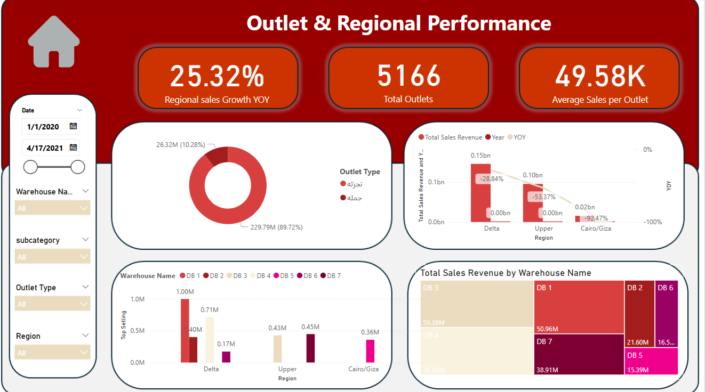
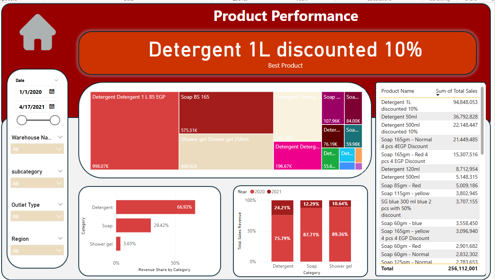
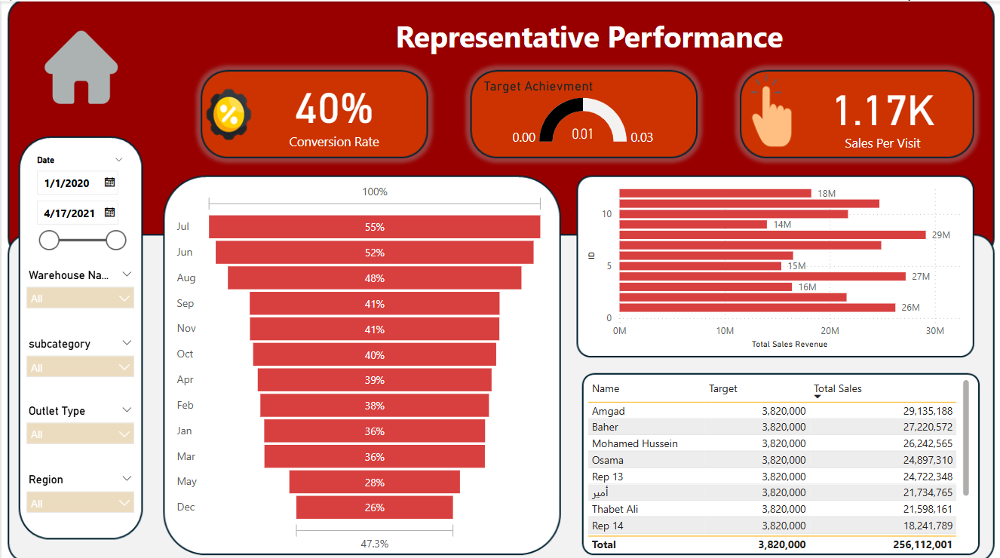

# FMCG-Analysis

## 1. Outlet & Regional Performance

### Overview
This dashboard provides insights into the regional and outlet performance metrics, including:

### Key Performance Indicators (KPIs)
- **Regional Sales Growth YOY:** 25.32% increase.
- **Total Outlets:** 5166 outlets.
- **Average Sales per Outlet:** 49.58K.

### Visual Breakdown
1. **Sales Distribution by Outlet Type:** Retail vs. Wholesale.
2. **Regional Sales Performance:** Breakdown by regions (Delta, Upper, Cairo/Giza) with their respective YOY growth.
3. **Top-Selling Warehouses:** Displaying total sales per warehouse.
4. **Total Sales Revenue by Warehouse Name:** Heatmap visualization of revenue per warehouse.
---

## 2. Product Performance

### Overview
This dashboard focuses on product sales performance, highlighting the best-selling products and their contribution to total revenue.

### Key Performance Indicators (KPIs)
- **Best-Selling Product:** *Detergent 1L discounted 10%* (94.8M in total sales).
- **Total Sales Revenue:** 256,112,001.

### Visual Breakdown
1. **Product Sales Breakdown (Treemap):** Visualization of different products and their sales contributions.
2. **Revenue Share by Category:**
   - Detergent: 66.93%
   - Soap: 29.42%
   - Shower gel: 3.65%
3. **Year-over-Year Performance (Bar Chart):** Comparison between 2020 and 2021 sales.
4. **Total Sales Overview (Table):** List of products with their total sales values.

---

## 3. Representative Performance

### Overview
This dashboard provides insights into sales representatives' performance, focusing on conversion rates, target achievement, and total sales revenue per representative.

### Key Performance Indicators (KPIs)
- **Conversion Rate:** 40%
- **Sales Per Visit:** 1.17K
- **Target Achievement:** 0.01 out of 0.03

### Visual Breakdown
1. **Monthly Conversion Rate (Bar Chart):** Displays conversion rates for each month, with July having the highest (55%).
2. **Total Sales Revenue (Bar Chart):** Shows sales revenue per representative.
3. **Target vs. Actual Sales (Table):** Compares each representative’s sales target to their actual total sales.
---

### Filters
Users can filter the data by:
- **Date Range** (From 1/1/2020 to 4/17/2021)
- **Warehouse Name**
- **Subcategory**
- **Outlet Type**
- **Region**

These dashboards provide a comprehensive view of sales performance, helping stakeholders make data-driven decisions.
